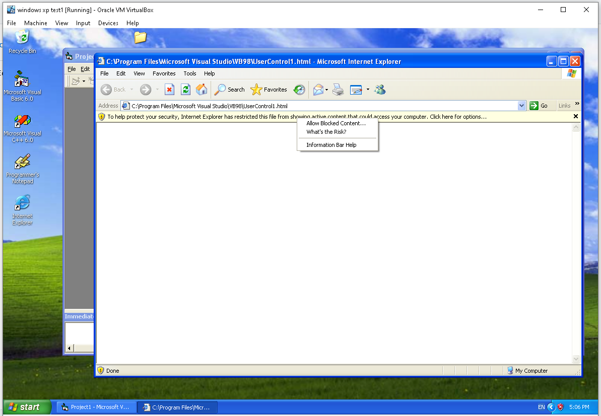

# poc_activex_control_winxp_vs6
proof of concept for creating ActiveX controls for Windows XP/Internet Explorer.

Pre-requisites:

1. Internet Information Services or XAMPP or WAMPP or some kind of HTTP server capable of serving html and ocx files.
2. Visual Studio 6, Visual Basic 6
3. Ability to install Windows XP on virtualbox or having Windows XP on a live machine(Windows 95, Windows 98, further windows may also work but may need additional steps not covered by this demo).
4. Ability to lower the security settings in internet explorer.

Tutorial:

1. Create a new ActiveX control project 


2. Add a label named "lblGreeting" with caption set to "Hello, World!" within the perimiter of the ActiveX control.


3. Press f5, to see the following dialog, titled "project properties", and press ok


4. Internet Explorer should open with a warning as seen below



5. Click allow blocked content. If you are seeing another warning instead, you need to go to Tools->internet options->Security->Custom Level and play around with the security settings(scroll down to ActiveX controls and plugins sections of the settings). This project is meant to be done on a throwaway Windows XP virtualmachine/secondary machine, with no logged in internet accounts, so the security levels should be permissive towards ActiveX controls.

Upon getting beyond the security warning, you should see your control visible in the client area of the webpage. Right click the client area and 
select "view source" in order to obtain the class id of the activex control, write the class id down, as we will need later.


6. In the Visual Basic 6 menu, go to the "Run" menu and press the "End" button.

7. Save the project somewhere you will remember, then go to File->make Project1.ocx


8. Put the ocx file somewhere in your localhost directory, I put mine into C:\inetpub\wwwroot\activexcontrols\project1.ocx, then create the following html file(you can make it a proper html structure if you wish later):

```html
<object 
   classid="clsid:6D8A3A97-F358-4263-8E59-FB8D6BCBDC4B" 
   codebase="http://localhost/activexcontrols/project1.ocx"></object>
```

9. Visit your activex control from the webpage that is using it, in my case it is, http://localhost/activexcontrols/project1.ocx.

You should see a prompt to install the control, such as one below.


10. You should see the same control you have seen before, but now it should be usable from other virtual machines as well. 


11. This is the end of the demonstration.
