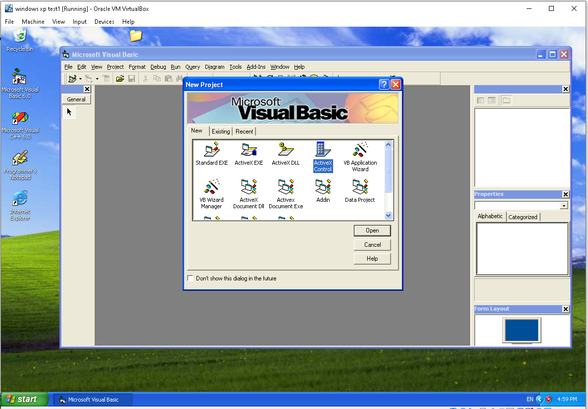
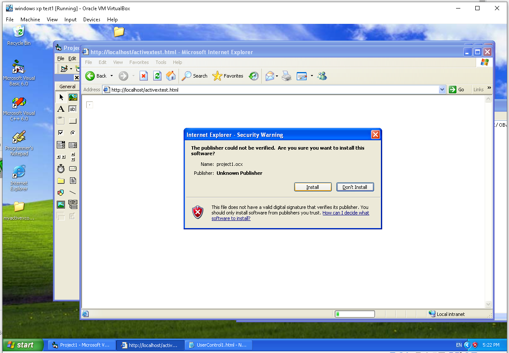

# poc_activex_control_winxp_vs6
proof of concept for creating ActiveX controls for Windows XP/Internet Explorer.

INTERNET EXPLORER!? WINDOWS XP!? WHY:

Internet Explorer does have plenty of security holes, however they are not an issue unless you are visiting untrusted sites that are waiting to take advantage of these security flaws. ActiveX gives us a unique power to run arbitrary programs on the webpage itself, which has became the foundation for technologies such as Adobe Flash(which to date has no reasonable alternatives) and Java applets. This tutorial will give you a foundational ability to
build similar frameworks/games/simulations/web-tools that work on older and more accessible systems. Had it not been for users shooting themselves in the  foot by being too trusting, letting malicious agents run full-fletched executables on their machines, we could still write web-tools/games and more that would work all the way from windows 95 to windows 10, instead, we are entering a new age where we are at a genuine risk of software not being able to
run at all unless it is signed by a developer whose name is registered in a web-store, greatly restricting the number of developers even willing to write code at all, as putting your name on the internet is not something everyone wants to do in this hyper-competitive cutthroat world.

This project will bring you back to a time when "always logged in" was still considered a terrible idea security wise, but at the same time, there were no restrictions on what you could and could not do with your computer. The fact that what is demonstrated in this demonstration is still possible, is 
a testamount to the love and effort put into these tools, as in the future, people trying to do things as they were in 2022 may not be possible, because of new versions of more aggressive DRM.

I was not able to do any of this back when this was still a thing people did, as I was relatively new to programming and the technology flew over my head,
but now that I am older and slightly more competent, I want to offer this demonstration so that at the very least, I can demonstrate basic understanding of the technology, and maybe somebody else finds it interesting.

Pre-requisites:

1. Internet Information Services or XAMPP or WAMPP or some kind of HTTP server capable of serving html and ocx files.
2. Visual Studio 6, Visual Basic 6
3. Ability to install Windows XP on virtualbox or having Windows XP on a live machine(Windows 95, Windows 98, further windows may also work but may need additional steps not covered by this demo).
4. Ability to lower the security settings in internet explorer.

Tutorial:

1. Create a new ActiveX control project 



2. Add a label named "lblGreeting" with caption set to "Hello, World!" within the perimiter of the ActiveX control.


3. Press f5, to see the following dialog, titled "project properties", and press ok


4. Internet Explorer should open with a warning as seen below


5. Click allow blocked content. If you are seeing another warning instead, you need to go to Tools->internet options->Security->Custom Level and play around with the security settings(scroll down to ActiveX controls and plugins sections of the settings). This project is meant to be done on a throwaway Windows XP virtualmachine/secondary machine, with no logged in internet accounts, so the security levels should be permissive towards ActiveX controls.

Upon getting beyond the security warning, you should see your control visible in the client area of the webpage. Right click the client area and 
select "view source" in order to obtain the class id of the activex control, write the class id down, as we will need later.


6. In the Visual Basic 6 menu, go to the "Run" menu and press the "End" button.

7. Save the project somewhere you will remember, then go to File->make Project1.ocx


8. Put the ocx file somewhere in your localhost directory, I put mine into C:\inetpub\wwwroot\activexcontrols\project1.ocx, then create the following html file(you can make it a proper html structure if you wish later):

```html
<object 
   classid="clsid:6D8A3A97-F358-4263-8E59-FB8D6BCBDC4B" 
   codebase="http://localhost/activexcontrols/project1.ocx"></object>
```

9. Visit your activex control from the webpage that is using it, in my case it is, http://localhost/activexcontrols/project1.ocx.

You should see a prompt to install the control, such as one below.



10. You should see the same control you have seen before, but now it should be usable from other virtual machines as well. 


11. This is the end of the demonstration.
